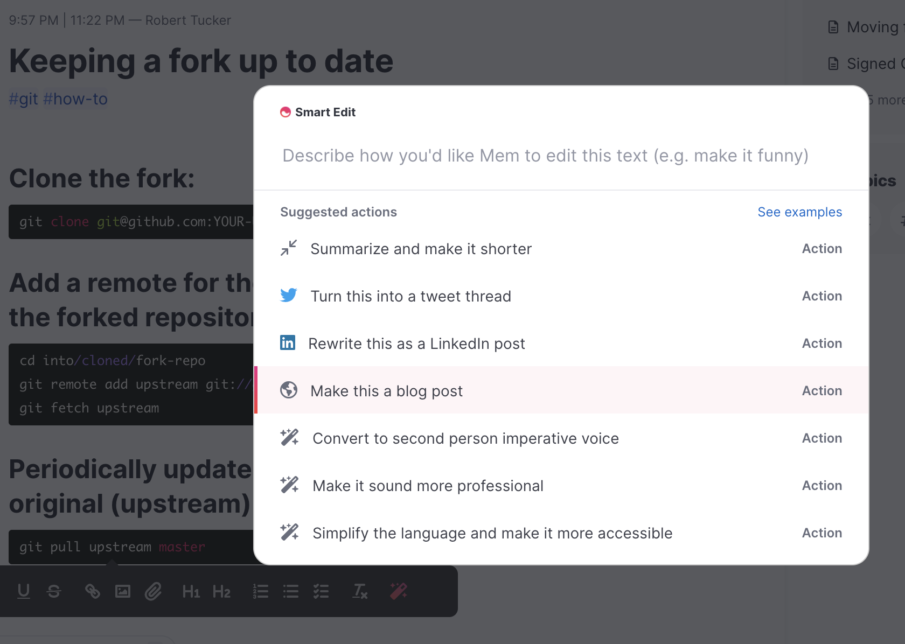
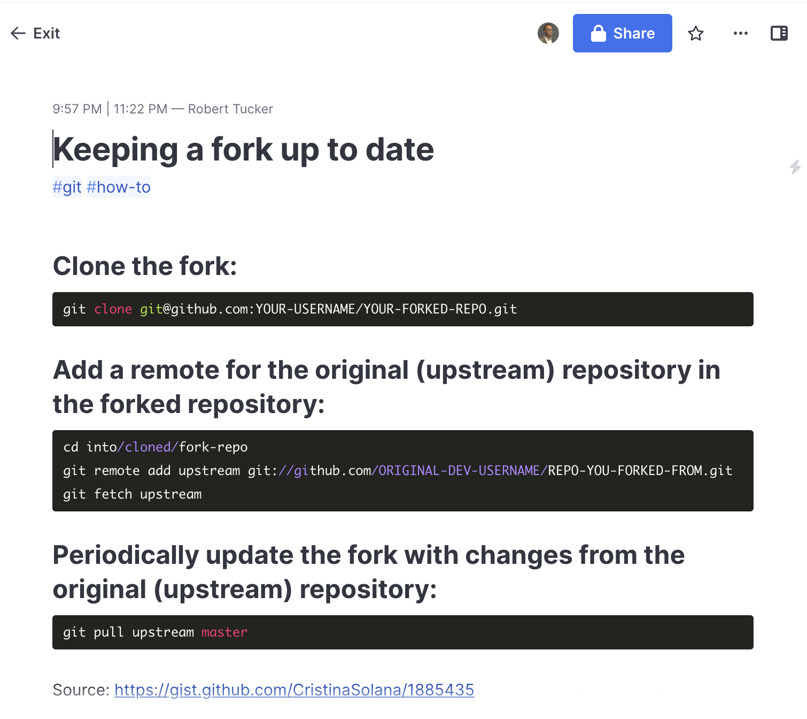

--- 
draft: false
date: 2023-01-08
title: An AI-Assisted Blog Post
description: How I used Mem to create a blog post.
slug: ai-blogging
authors: [Robert Tucker]
tags: [ai, git, gtd, mem]
categories: [Writing]
---

Here I was thinking that I was about due for another blog post (it's been almost a year, after
all...) and \***BOOM!**\* post content literally appears on my screen.



## Some background

While I wouldn't call myself a [GTD](https://gettingthingsdone.com/what-is-gtd/)-adherent in the
strictest sense, I am a longtime fan and regularly work at implementing some of the key principles
in pursuit of personal productivity. One such tactic is the practice of dumping everything into a
central place so as to achieve the "*Mind Like Water*" state that results from not having to worry
about what I might be forgetting.

I've been a [Mem](https://get.mem.ai/) user since it was in beta (over 18 months now). The idea
being that all the meeting notes, action items, ideas, to-dos, etc. I have get added to Mem as
individual pieces of content (called "mems", btw). To be honest, I didn't fully commit to it until
about 6 months ago and I only recently became a paying subscriber in order to take advantage of
some of the AI-powered insights and connections available for the mems I have created.

## And so

Yesterday, I needed to pull in updates from an upstream repository I forked on
[GitHub](https://github.com). It had been ages since the last time so I had to look up the best
way to do it. Because I practice what I preach, I was creating a mem so I could quickly recall the
process should I forget how by the next time I need to do so. The mem itself is pictured below.



As I was highlighting content to format it, I noticed Mem's *Smart Edit* button on the popup menu
and decided to click it. That's what resulted in a dialog similar to the first image pictured above.
When I finished editing, I highlighted all of the content and let Mem's AI do the work. The result
follows.

## The Post (pasted in its entirety)

Keeping a fork of a repository up to date with the original repository is a relatively simple process. It requires that you have a fork of the original repository, and that you have cloned the forked repository to your local machine.

The first step is to add a remote for the original (upstream) repository in the forked repository. This is done by navigating to the cloned fork repository on your local machine and running the following command:

``` bash
git remote add upstream git://github.com/ORIGINAL-DEV-USERNAME/REPO-YOU-FORKED-FROM.git
```

The next step is to fetch the upstream repository. This will ensure that you have all the latest changes from the original repository. To do this, run the following command:

``` bash
git fetch upstream
```

To periodically update the fork with changes from the original (upstream) repository, run the following command:

``` bash
git pull upstream master
```

By periodically running this command, you will ensure that your fork is always up to date with the original repository. This is a good practice to follow to ensure that any changes you make to your fork are compatible with the latest version of the original repository.

It is also important to note that if you make any changes to your fork, you should also push those changes back to the original repository. This allows the original repository to benefit from any improvements you make to your fork. To do this, make sure to commit any changes you make to your fork and then push them to the original repository.

In conclusion, keeping a fork of a repository up to date with the original repository is an important task to ensure that your contributions to the original repository are compatible with the latest version. By following the steps outlined above, you can ensure that your fork is always up to date with the original repository.

## Conclusion

While I'm the last one that should be judging anyone's writing, I feel like it's a little verbose
(Mem does have options to improve this) and the style is somewhat stilted for my taste. Nevertheless,
color me impressed! I'll have to do some more experimenting with different types of content. I'd have to
say that AI-assisted blogging can definitely help save time on content creation. Who knows, it might even
improve the quality of my work. I can't promise I'll blog more, but it's a thought.
