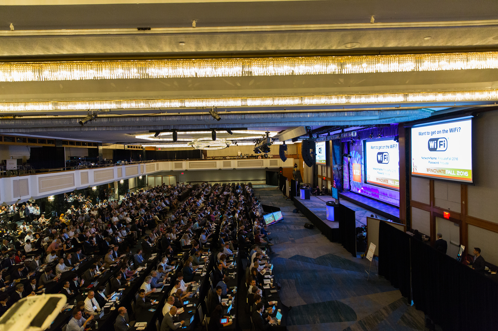

--- 
draft: false
date: "2017-11-04"
title: "I did a thing: FinovateFall 2017"
description: "Post about my presentation/demo at Finovate 2017"
slug: "finovate-2017"
authors: [Robert Tucker]
tags:
- quadient
- ai
- fintech
categories:
- Speaking
---

Back in September, I had the opportunity to represent my employer, [Quadient](https://quadient.com), on the main stage at the [FinovateFall 2017](https://finovate.com/live-demos-deep-dives-finovatefall-takes-twitter) conference held in New York City. Now that the video has been posted, I thought I'd describe the experience before embedding it [below](#the-video).

### The Event

Here's how [Finovate](https://finovate.com) describes their event:

> \[Finovate\] provides fintech professionals with an opportunity to see the future of fintech today. The companies that demo their technologies live at Finovate conferences are the same innovators that financial institutions all over the world seek out for partnerships, collaborations, and insights into how to use technology to better serve, engage, and understand their customers and clients.

As far as demos go, Finovate has a unique way of keeping things interesting for attendees. Presenters have seven minutes. Period. No, really. When the time expires, a bell rings, mics get cut and the stage goes dark.

### The Demo

The intent of the demo was to show how the [Quadient platform](https://www.quadient.com/intelligent-communication/how-we-help/digital-transformation) can be used to provide AI-assisted, personalized customer interactions with dynamically-created forms while maintaining compliance with brand, regulatory and contract requirements. Given the limited time available, we decided to go with use-case based on a simplified loan application.

I built a virtual assistant (chat-bot) that uses [Facebook Messenger](https://developers.facebook.com/products/messenger) and [Natural Language Processing](https://en.wikipedia.org/wiki/Natural_language_processing) (NLP) to handle the interactions and orchestrate the process. Tech-wise, it was done using a couple of [ExpressJS](https://expressjs.com) apps on top of [MongoDB](https://www.mongodb.com). Integration with the Quadient platform components was all done using standard product APIs.

While I'm no stranger to presenting in front of an audience, the picture above just can't convey the feeling of intimidation that I got taking the stage in front of ~1500 people. Did I mention the seven minute timer? At any rate, I've embedded the video below. Can you tell where I had my "\**gulp*\* Stuff just got real!" moment?

### The Video



### Conclusion

If you watched the whole thing, you know that we finished just as time was about to expire. In hindsight, I'm really glad I had the opportunity to do this and, yes, I'd do it again. Special thanks go out to [Antoine Hemon-Laurens](https://linkedin.com/in/anthemlau) who did all the heavy lifting to secure the spot and co-presented. He wrote a blog post of his own about it [here](https://www.quadient.com/blog/5-steps-improving-cx-when-processing-loan-applications-quadient-technology-ai).
