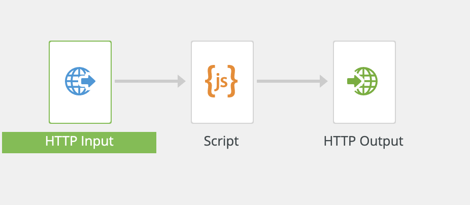

--- 
draft: false
date: 2019-08-09
title: "Integrating Apache Kafka and Inspire Scaler"
description: "Proof of concept integration of Apache Kafka with Inspire Scaler"
slug: kafka2scaler
authors: [Robert Tucker]
tags:
- integration-patterns
- quadient
- apache-kafka
- apache-camel
- spring-boot
- java
categories:
- Integration
- Development
---
## Introduction

With the advent of new industry paradigms (a.k.a. buzzwords) like big data and micro-services architecture, many enterprise customers are starting to incorporate traditionally cloud-centric programming technologies and architectural components in their environments (whether that be on-prem, cloud or a hybrid of the two). Enterprise architects are realizing that wide streams of data need to be captured and processed in order to build the next generation of digital services like predictive analytics and artificial intelligence (AI). Over the last few years, [Apache Kafka](https://kafka.apache.org) has been gaining popularity as a key component of these streaming data pipelines. As such, it is not uncommon to get queries from prospects' IT groups as to whether or not [Quadient](https://quadient.com) can integrate with Kafka. This post will provide a high-level overview and walk-through of one such way [Inspire Scaler](https://www.quadient.com/intelligent-communication/customer-communications/omnichannel-communications-interactions/inspire-platform) and Apache Kafka could be integrated to work together.

## Solution Components

### Apache Kafka

[Apache Kafka](https://kafka.apache.org) is a fault-tolerant, horizontally-scalable publish-subscribe message system designed to power distributed applications. Kafka was originally designed by engineers at [Linked In](https://www.linkedin.com) who were looking to process large amounts of event data from their web site and infrastructure in real-time. To achieve the message volumes needed, Kafka forgoes some of the features associated with traditional [Message-oriented middleware](https://en.wikipedia.org/wiki/Message-oriented_middleware) messaging systems like [ActiveMQ](https://activemq.apache.org) and [RabbitMQ](https://www.rabbitmq.com). In particular, Kafka does not provide header-based mechanisms like correlation identifiers and reply-to queues as is customary with the aforementioned  messaging systems to support closed-loop or request-response processing. It also does not track how many consumers there are for a particular topic and which messages have been read. The industry buzzword "big data" certainly applies here, though, as companies like Linked In, [Twitter](https://twitter.com), [Netflix](https://www.netflix.com) and [AirBnB](https://www.airbnb.com) use Kafka at web-scale and report processing billions and even [trillions](https://www.confluent.io/blog/apache-kafka-hits-1-1-trillion-messages-per-day-joins-the-4-comma-club/) of messages per day.
### Inspire Scaler

In terms of input, [Inspire Scaler](https://www.quadient.com/intelligent-communication/customer-communications/omnichannel-communications-interactions/inspire-platform) currently supports several types of inbound communication options. If we eliminate the Quadient-specific channels and scheduled input, we are left with [FTP](https://en.wikipedia.org/wiki/File_Transfer_Protocol), Hot-folder, [HTTP](https://en.wikipedia.org/wiki/Hypertext_Transfer_Protocol), [JMS](https://en.wikipedia.org/wiki/Jakarta_Messaging) and [RabbitMQ](https://www.rabbitmq.com). Given some of the specific [shortcomings identified with Kafka](#Apache-Kafka), JMS or RabbitMQ might make for good choices to increase reliability in a production environment. For the purpose of this guide, however, we'll use HTTP as our input channel to limit the amount of additional configuration and setup required in order to demonstrate interaction with Kafka.

### Apache Camel

[Apache Camel](https://camel.apache.org) is a framework focused on simplifying integration. Its core feature is a routing and mediation engine that allows developers to write their own routing rules that determine, among other things, where input (messages) will come from and how those messages will need to be processed and potentially transformed before being sent to their destination. Camel offers high-level abstractions that make it easy to interact with various systems using the same API regardless of the protocol or type(s) of data the systems are using. Camel has a strong community for only having been around since 2007 and, in fact, currently has support for over 80 protocols and data types out-of-the-box. Because of its strong support for routing, transformation and orchestration, Camel is often likened to a lightweight ESB (or [Enterprise Service Bus](https://en.wikipedia.org/wiki/Enterprise_service_bus)), which it is not. In particular, it does not have its own container. For that, we'll use the component in the next section.

### Spring Boot

The [Spring](https://spring.io) framework is a project that was started back in the early 2000s in order to reduce the complexity associated with developing Java [J2EE](https://en.wikipedia.org/wiki/Jakarta_EE) (Java Enterprise Edition) applications. It achieves this by providing a comprehensive programming and configuration model for creating modern, Java-based applications. [Spring Boot](https://spring.io/projects/spring-boot) is a more recently developed extension of the Spring framework that makes it easier than ever to set up, configure and run both console- and web-based Java applications. Spring Boot takes an opinionated view of the Spring platform which allows it to reduce the boilerplate configuration required for setting up Spring applications. This frees up developers to worry less about the "plumbing" and allows them concentrate on what the application needs to do.

## Solution Architecture

From an integration perspective, we will be using Camel to implement the [*Message Gateway* pattern](https://www.enterpriseintegrationpatterns.com/patterns/messaging/MessagingGateway.html). As per the pattern, Camel handles all of the communication with Kafka so Scaler will not require any Kafka-specific code or configuration.


## How-To Guide

The instructions in this section provide a step-by-step guide to creating and configuring a Spring Boot application using Apache Camel to provide a gateway to Inspire Scaler. A full copy of the completed project and its assets can be found [on GitHub](https://github.com/robertwtucker/kafka2scaler-demo). This guide assumes that you already have a working Kafka/Zookeeper environment up and accessible from your local machine. If not, a [Docker demo environment](#using-the-docker-demo-environment) is provided. Should you wish to install and run Kafka directly on your local machine, please see the [Kafka Quickstart](https://kafka.apache.org/quickstart) tutorial for instructions.

### Prerequisites

This guide assumes that the following software is properly installed and configured on the machine being used. For more information, please see the installation links provided.

* A **Java JDK for version 8** with the latest updates. At the time of this writing, that is 8u222-b10. Given the recent change in [Oracle's licensing terms for Java](https://www.oracle.com/technetwork/java/javase/terms/license/javase-license.html) releases, there are new restrictions around what is permissible under the license and this has created a lot of uncertainty (i.e. What activities qualify as "development?"). As such, [Azul System's](https://www.azul.com) Zulu Community builds of OpenJDK provide a great cross-platform alternative. So, if you do not already have a JDK installed, see the [Zulu Community download page](https://www.azul.com/downloads/zulu-community/) to find the latest version 8 JDK for your platform.

* **Inspire Scaler** running locally and using default port (30600). A remote Scaler server will work as long as the appropriate host name and port are substituted where `localhost:30600` is used in the instructions. This guide was created and tested with Scaler v12.5.0.18-FMAP.

* The **[Docker Engine](https://docs.docker.com/)** and the **[Docker Compose](https://docs.docker.com/compose/) tool** for defining and building multi-container Docker applications. This step is optional if you are not using the [Docker demo environment](#using-the-docker-demo-environment) described later in this document. See the multi-platform installation instructions available for the [Docker Engine](https://docs.docker.com/install/) and [Docker Compose](https://docs.docker.com/compose/install/) tool, respectively. The latest stable version for your platform is recommended but any Docker Engine release after 17.12.0 should work (the compose file uses format version 3.5). This guide was prepared and tested with Docker Engine version 18.09.2 and Docker Compose version 1.23.2.

* The latest binary download of **[Apache Kafka](https://kafka.apache.org/)** (currently 2.3.0). See the [Kafka download page](https://kafka.apache.org/downloads) for more information. If Docker is already installed, there is an option to use Docker images in lieu of installing Kafka. This is not recommended unless you are familiar with Docker and how networking and volume creation work.

### Create an Inspire Scaler Workflow

In many cases, the Scaler workflow(s) we will need to integrate with (invoke) will already exist. For this guide, we will create a simple workflow with only those items needed to prove the efficacy of the process.

1. To begin, access the user interface for the local instance of Scaler at [`http://localhost:30600`](http://localhost:30600).

2. Log in as an administrator and create a new *On Demand* workflow. Our example will be named *Simple Scaler Endpoint*.

3. Using the workflow editor, add three Scaler workflow components in this order:

   * HTTP Input
   * Script
   * HTTP Output

   You can either drag and drop the components from the palette to the canvas or just double-click them in the palette to move them over. Once finished, make sure that the components are all linked together in the aforementioned order.

   

4. Edit the **HTTP Input** component. Enter `simplews` for the *URL Endpoint* and set the *API authentication group* to *no authentication*. Take note of the *Request URL*. We will need this information later in order to contact this workflow via HTTP. Be sure to click *OK* to close the component detail popup and not the *X* so that the changes made will be persisted in memory.

   

5. Open the **Script** component. In the *Variables* tab, click the *Required* checkbox for the *body* variable.

6. Add a simple line of script, `console.info(getvar("body"))`, in the code area. This will allow us to see exactly what was passed to Scaler in the body of the HTTP request from the *Job* details once the request is completed. Click *OK* to close the window.

   

7. Edit the **HTTP Output** component, setting the *Response Type* to *Confirmation (HTTP 204)* before clicking *OK*.

8. At this point, our workflow is complete. Click the *disk* icon in the toolbar to save all of the in-memory changes to the database and the *up and right arrow* nearby to publish the initial draft of the workflow as version 1. Click *OK* to confirm.

9.  With the *Sample Scaler Endpoint* workflow selected in the *On Demand* workflows screen, click the *play* icon in the toolbar to deploy the workflow.

### Create a Topic in Apache Kafka

For simplicity's sake, this section is written as though the [Docker demo environment](#using-the-docker-demo-environment) is being used. If this is not the case and you have your own Kafka/Zookeeper environment available, please adjust the command parameters below and throughout the rest of this guide, as appropriate.

Before proceeding further, read the [Using the Docker Demo Environment](#using-the-docker-demo-environment) section and follow the instructions to start it up. Once the Kafka server is running, open a terminal window or command prompt and switch to the directory you installed Kafka in. To create a topic to use for passing messages to Scaler, run one of the following scripts with the supplied parameters based on your operating system:

*MacOS & Linux*
``` bash
> bin/kafka-topics.sh --bootstrap-server localhost:9092 --create --topic inspire --replication-factor 1 --partitions 1
```

*Windows*
``` bash
> bin\windows\kafka-topics.bat --bootstrap-server localhost:9092 --create --topic inspire --replication-factor 1 --partitions 1
```

If you would like to verify that the topic was properly created, you can use the command with the `--list` parameter and you should see **inspire** listed among the output.

*MacOS & Linux*
``` bash
> bin/kafka-topics.sh --bootstrap-server localhost:9092 --list
```

*Windows*
``` bash
> bin\windows\kafka-topics.bat --bootstrap-server localhost:9092 --list
```

As mentioned previously, there is an option to use a Docker container based on the same Kafka image used for the demo environment in lieu of installing Kafka's binary distribution. For example, to create the topic in Kafka, you could execute the following:

``` bash
> docker run --rm --network kafka-demo confluentinc/cp-kafka \
>   kafka-topics --zookeeper zookeeper:2181 --create \
>   --topic inspire --replication-factor 1 --partitions 1
```

**Important**: Because the [Confluent Platform](https://www.confluent.io/product/confluent-platform/) Docker image for Kafka defines three volume mount-points, each time a `docker run` command using the image is executed, three new Docker volumes are created. Even though these volumes are very small in size, this can lead to the creation of a plethora of Docker volumes without an associated container. Use a Docker command similar to the following (adjust as appropriate for your operating system) to make sure that these are cleaned up when you are finished working with the containers:

``` bash
> docker volume rm $(docker ls -qf dangling=true)
```

### Create a Spring Boot project with Spring Initializr

1. In the browser, navigate to the Spring Initializr at [https://start.spring.io](https://start.spring.io).

   

2. Choose *Gradle Project* as the type of project and leave the *Language* and *Spring Boot* settings at their default.

3. Feel free to customize the name and description values in the *Project Metadata* section as appropriate. For the purposes of this walk-through, please do not change the *Packaging* or *Java* selections from *Jar* and *8*, respectively.

4. In the *Dependencies* section, type in '`camel`' and click the plus sign to add *Apache Camel*.

5. Click *Generate the project* to download a ZIP file containing the Spring Boot project structure and files that have been created according to the previous choices. Later on, we'll customize the project's configuration to build and run a Java application.

6. Expand (unzip) the project to a directory on disk. This will now be referred to as the `${project-root-dir}` or project root directory.

### Configure Apache Camel

[Apache Camel's](https://camel.apache.org) integration framework provides the mechanism we will use to connect Kafka and Scaler. Using Camel's *route* idiom, we will define the system endpoints (*connector* configuration), how information (in the form of a *message*) will travel between them and what, if any, transformation and/or processing of the *message* might be required along the way.

Before we can define the route, we need to add the Camel connectors we will be using with our system endpoints. Camel already has a connector built specifically for Kafka. For Scaler, we will use the HTTP connector based on Apache's HTTP Client Library version 4.

1. Using a text editor or Java development IDE, if you have one, edit the `build.gradle` file in the project's root directory. In the *dependency* section,  duplicate the line that starts with *implementation* twice and modify the copied lines so that the section looks like the following:

   ```
   dependencies {
	   implementation 'org.apache.camel:camel-spring-boot-starter:2.24.0'
	   implementation 'org.apache.camel:camel-kafka:2.24.0'
	   implementation 'org.apache.camel:camel-http4:2.24.0'
	   testImplementation 'org.springframework.boot:spring-boot-starter-test'
   }
   ```

   The version numbers might have changed by the time you are reading this, so just use whatever is current. Save and close the file.

2. Create a new sub-directory under the `${project-root-dir}/src/main/resources` directory named `camel`.

3. Create a file named `routes.xml` in the `${project-root-dir}/src/main/resources/camel` directory and open it for editing.

4. Copy and paste the route definition that follows into the editor:

   ``` xml
   <routes xmlns="http://camel.apache.org/schema/spring">
      <route id="kafka2scaler">
         <from uri="kafka:{{kafka.consumer.topic}}?brokers={{kafka.brokers}}&amp;groupId={{kafka.consumer.groupId}}&amp;seekTo={{kafka.consumer.seekTo}}"/>
         <log message="Kafka sent: [${body}]"/>
         <to uri="http4:{{http.host}}:{{http.port}}{{http.resourceUrl}}?httpMethod={{http.method}}"/>
         <log message="Scaler returned:[HTTP ${header.CamelHttpResponseCode}], Body:[${body}]"/>
      </route>
   </routes>
   ```

   Save and close the file.

5. Rename the `application.properties` file under `${project-root-dir}/src/main/resources` to `application.yaml` and open it for editing.

6. Copy and paste the application configuration information below into the editor:

   ``` yaml
   camel:
     springboot:
       main-run-controller: true

   kafka:
     brokers: localhost:9092
     consumer:
       topic: inspire
       groupId: demo
       seekTo: end

   http:
     host: localhost
     port: 30600
     resourceUrl: /rest/api/submit-job/simplews
     method: POST
   ```

   Save and close the file.

### Build and Run the Application

Using a terminal window or command prompt, switch to the project's root directory. If all of the steps in the [previous section](#configure-apache-camel) were completed correctly, we should be able to build and run our application. Use the [Gradle](https://gradle.org) build tool provided with the project to compile the source files.

``` bash
> ./gradlew build
```

Windows users can omit the '`./`' prefix on the command above. This is only required for MacOS and *nix platforms.

If everything is correct, you will see a `BUILD SUCCESSFUL` message once all of the dependencies are downloaded, the files are compiled and tests are run. If not and errors are produced, recheck the changes made to the source files in the [previous section](#configure-apache-camel). Ensure that no extra spaces were copied into the files. This is particularly important with the *application.yaml* file. Finally, make sure the files have been saved before trying again.

When the application is compiled, we can now use the Spring Boot plugin to run the application directly.

``` bash
> ./gradlew bootRun
```

As the application starts, several informational messages will be logged to the console. Once connected to Kafka, the application will wait for a message to be published to the **inspire** topic.

### Send a Message to Kafka

With our application waiting to do work, it's now time to send (produce) a message to our Kafka topic for our application to consume. Open a new terminal window or command prompt and switch to the directory you installed Kafka in. To produce a message, run one of the following scripts with the supplied parameters based on your operating system:

*MacOS & Linux*
``` bash
> bin/kafka-console-producer.sh --broker-list localhost:9092 --topic inspire
```

*Windows*
``` bash
> bin\windows\kafka-console-producer.bat --broker-list localhost:9092 --topic inspire
```

This starts Kafka's *Console Producer*. Anything typed on the line will be sent to our topic on the Kafka server. At the prompt, type in a fictitious JSON payload and hit `Enter` to send it:

``` json
> {"data":{"name":"foo","value":"blah"}}
```

If you look back at the terminal window/command prompt running our Java application with Camel, you should see entries in the log similar to the image that follows:


You can exit the *Console Producer* by typing `Control+C`.

### Verify Scaler Received the Message

While the log output told us that Scaler returned `HTTP 204` like we configured it to, let's go ahead and verify that Scaler received the message in its entirety.

1. Access the user interface for [the local Scaler instance](http://localhost:30600).

2. Log on as an administrator and navigate to the *Job Monitoring* screen (*Jobs* tab).

3. Under *Job ID*, click on the link for the most recently executed job for the *Simple Scaler Endpoint* workflow.

4. Select the *Script* component in the *Job Details* window and the *Script Log* should show the JSON payload we sent to Kafka.

   

Aaand we're done! You have now successfully sent a message to Inspire Scaler via Apache Kafka! Congratulations!

## Areas for Further Study and/or Investigation

It almost goes without saying that a customer's production implementation will involve many more requirements and much more complexity than the simple proof of connectivity undertaken with this guide. Some areas for further investigation and future validation are included in the sections below.

### Calling Scaler with Authentication Enabled

When Default authentication is enabled in Scaler, Camel's HTTP4 component configuration needs to change so that user credentials are passed with the request to Scaler. There are two ways to go about this.

#### Option 1: Setting the Authorization Header
While the mechanics are beyond the scope of this document, Camel's exchange of in/out parameters will generally preserve headers along the entire route and pass the set to each component. We can use this feature to set an HTTP Authorization header prior to invoking the HTTP4 component and it will pass this header to Scaler. For basic authentication, the Authorization header is expected to be formatted as:

```
Basic c3lzdGVtOlBhc3N3b3JkMQ==
```

where the string of characters following `"Basic "` is a base64-encoded value formed by encoding the username and password joined by a colon. This can be added to the HTTP section in the application configuration file (*application.yaml*) as shown below:

``` yaml
http:
  auth-header: Basic c3lzdGVtOlBhc3N3b3JkMQ==
```

In the *routes.xml* file, add the following before line with the HTTP4 component:

``` xml
<setHeader headerName="Authorization">
  <constant>{{http.auth-header}}</constant>
</setHeader>
```

#### Option 2: Setting Parameters in the URI

If you would rather not work with base64-encoded values, the username and password to use can be included directly in the HTTP4 component's URI configuration. With the username and password added to the application configuration file (*application.yaml*):

``` yaml
http:
  username: system
  password: Password1
```

the HTTP4 component in the *routes.xml* file can be modified as follows:

``` xml
<to uri="http4:{{http.host}}:{{http.port}}{{http.resourceUrl}}?httpMethod={{http.method}}&amp;authUsername={{http.username}}&amp;authPassword={{http.password}}&amp;authenticationPreemptive=true"/>

```

### Creating a Response in Scaler and Publishing it to Kafka

Update: This exercise is covered in [Sending Output from Inspire Scaler to Apache Kafka](/posts/scaler2kafka/).

## Using the Docker Demo Environment

In order to provide ready access to a Kafka environment for testing this integration, a Docker Compose file that creates a single-node instance of Apache Kafka along with an Apache Zookeeper server is included with the project assets. The Zookeeper server is required by Kafka to support many of the distributed features (leader elections, partitions, etc.).

To start the demo environment, from a console window or command prompt in the project root directory, execute:

``` bash
> docker-compose up -d
```

This will create a network and start both server instances in *daemon* or background mode. By default, Kafka's primary listener will be bound to port `9092` of the host machine (`localhost:9092`). Because of the peculiarities of networking with Docker, a second listener has been configured to run on port `29092`. If you plan to connect to the demo Kafka server from another container (internal to Docker, on the `kafka-demo` network), you will need to use `kafka:29092` for the commands or parameters that require supplying the address of the Kafka broker.
