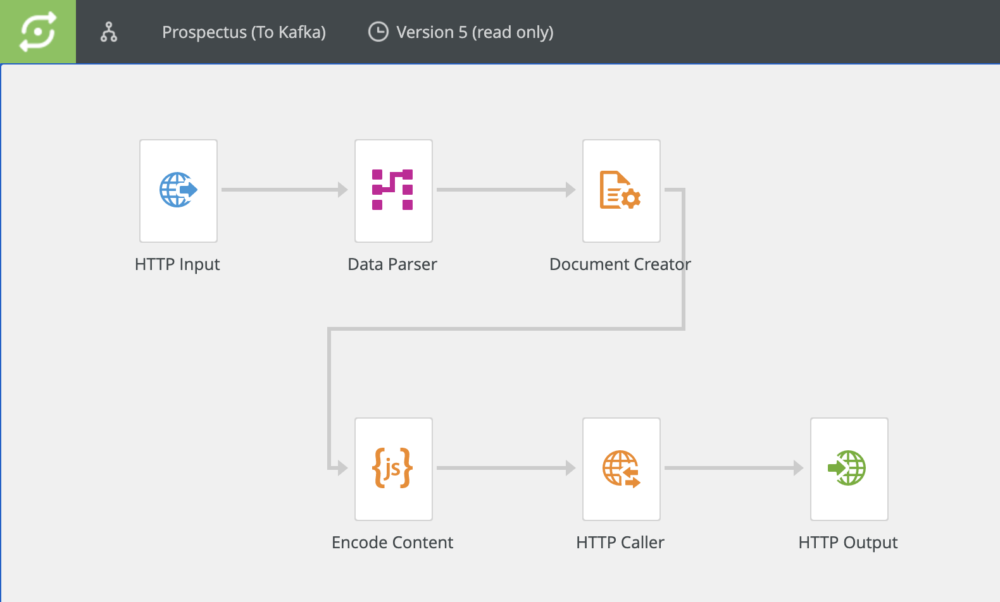
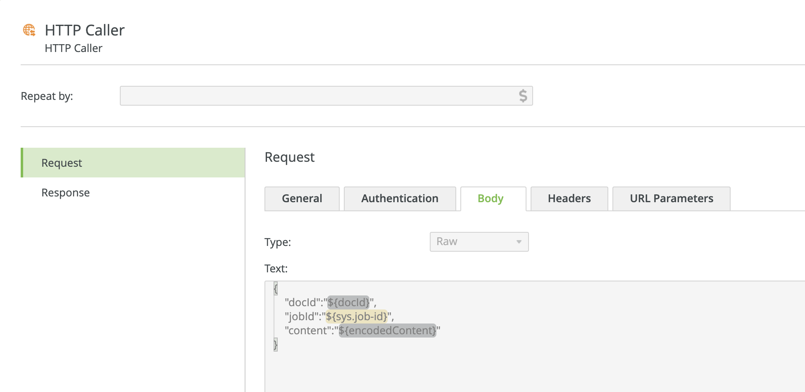

--- 
draft: false
date: 2022-01-02
title: "Sending Output from Inspire Scaler to Apache Kafka"
description: "Further PoC work to demonstrate producing Kafka messages from Scaler"
slug: "scaler2kafka"
authors: [Robert Tucker]
tags:
- integration-patterns
- quadient
- apache-kafka
- apache-camel
- spring-boot
- java
categories:
- Integration
- Development
---


Beginning with R15.4-FMAP and enhanced in R15.5-FMAP, Inspire Scaler now provides direct support for
consuming input/producing output via Apache Kafka v2.x and v3.x. This functionality will be
generally-available in the R16.0 release which is currently planned for June 2023.


### Introduction

This post presents a simple proof-of-concept by which content generated by [Inspire Scaler](https://www.quadient.com/experience/omnichannel-communications-interactions/inspire-platform) is sent to [Apache Kafka](https://kafka.apache.org) via [Apache Camel](https://camel.apache.org). It is a continuation of the work described in [Integrating Apache Kafka and Inspire Scaler](/posts/kafka2scaler/) and, as such, it is strongly recommended that you read the original post first to establish the proper context. Since we'll be using the same infrastructure for this solution, I'll take the lazy way out and link back to the previous post gratuitously.

When I did the original integration work, publishing output from Scaler to Kafka was left as an exercise for future study. It took about twenty months but I finally had a colleague in Pre-Sales whose prospect's requirements prompted me to revisit it. As before, the companion repository with all of the source code used in this post is available [on GitHub](https://github.com/robertwtucker/scaler2kafka-demo).

### Prerequisites

Despite the fact that the software packages involved continued their evolution in the intervening time-frame, none of the upgrades involved breaking changes. The main change made was switching to Java 11 since Java 8 was getting a little "long in the tooth" and was about to reach end of support. 

  * Java 11 JDK
  * Inspire Scaler R14 GA or later
  * Apache Kafka 2.3 or later
  * Docker 18.09.2 or later (optional)

If you do not already have a Kafka installation available, refer to the [Using the Docker Demo Environment](/posts/kafka2scaler/#using-the-docker-demo-environment) section in the original post for details on creating one in [Docker](https://docker.com).

### Apache Kafka

Follow [these instructions](/posts/kafka2scaler/#create-a-topic-in-apache-kafka) to create a topic named `inspire-out` in Kafka (substituting the name parameter on the command line, where appropriate). 

### Apache Camel

Like before, we'll use a Spring Boot application to host Camel. You can follow [the instructions](/posts/kafka2scaler/#configure-apache-camel) from the previous post or clone the application from the repository on GitHub:

``` bash
> git clone https://github.com/robertwtucker/scaler2kafka-demo.git
```

For this simple example, two routes are created in the [Camel configuration file](https://github.com/robertwtucker/scaler2kafka-demo/blob/master/src/main/resources/camel/routes.xml) as follows:

``` xml
<routes xmlns="http://camel.apache.org/schema/spring">
    <route id="scaler2kafka">
        <from uri="undertow:{{undertow.protocol}}://{{undertow.host}}:{{undertow.port}}{{undertow.resourceUrl}}"/>
        <log message="Received input from Scaler, sending to Kafka"/>
        <to uri="kafka:{{kafka.topic}}?brokers={{kafka.brokers}}&amp;groupId={{kafka.producer.groupId}}"/>
    </route>
    <route id="kafka2file">
        <from uri="kafka:{{kafka.topic}}?brokers={{kafka.brokers}}&amp;groupId={{kafka.consumer.groupId}}&amp;seekTo={{kafka.consumer.seekTo}}"/>
        <log message="Received message from Kafka, writing to file"/>
        <to uri="file://{{file.outputDir}}"/>
    </route>
</routes>
```

The `scaler2kafka` route uses the [Camel Undertow Component](https://camel.apache.org/components/3.14.x/index.html) to expose an HTTP endpoint that we can send information to using an `HTTP POST`. It logs some diagnostic information to the console before sending a message to the designated Kafka topic. The HTTP request payload becomes the body of the Kafka message produced.

The `kafka2file` route sets up a Kafka consumer using the [Camel Kafka Component](https://camel.apache.org/components/3.14.x/kafka-component.html). It reads messages from the designated Kafka topic and logs a message to the console before writing the message contents to a file on disk for inspection. In a real scenario, the receiving application(s) would parse the message to extract the document output before taking additional action.

### Inspire Scaler

Depending on the Inspire document application being used, the Scaler workflow might vary from that depicted below. The key action begins with configuring the **Document Creator** component to send its output to the `spool` custom variable. This is usually the default but that might not be the case if you are adapting an existing workflow. 
  


#### Script Component

Insert a **Script** component in the workflow somewhere after the **Document Creator** (labelled *Encode Content* in the image above). Put in a script that base64-encodes the output and stores it in the `encodedContent` custom variable.

``` javascript
setvar("encodedContent", base64.encode(getvarBytes("spool")))
```

#### HTTP Caller Component

Add an **HTTP Caller** component after the script. This will be responsible for calling the HTTP endpoint we'll expose in Apache Camel.
###### HTTP Request — General Tab

Enter or configure a value for the **Request URL** that will resolve to the address that the `scaler2kafka` Camel route is listening to. If you're using the application from the companion repository with the default configuration, the service will be listening at `http://localhost:10101/bridge`. Set the **Request method** to `POST`.


###### HTTP Request — Body Tab

Create a payload for the body of HTTP Request that will communicate the document output that was base64-encoded in the earlier step. As shown below, I included some additional metadata that might be useful for a hypothetical downstream application/service that will consume the message from Kafka.
  


### Running the Application

Using a terminal window or command prompt, switch to the project’s root directory and launch the application.

``` bash
> ./gradlew bootRun
```

> **Tip**: Windows users can omit the ‘`./`’ prefix on the command above.

If all goes well, you should get output similar to the [asciinema](https://asciinema.org/) session that follows.

[](https://asciinema.org/a/XCHkS6Jpasf6nHUTXw1EMmB3y)
